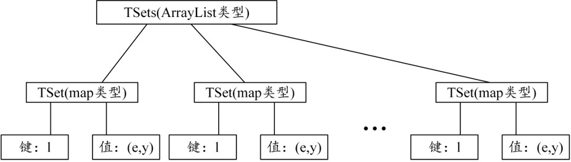
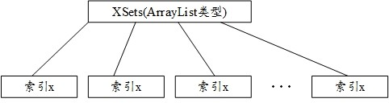

# Sun的方案

## 论文
参考文献：Shi-Feng Sun_An Effient Non-Interactive Multi-client Searchable Encryption.pdf

### 下图是TSets的结构


### 下图是XSets的结构


## 复现实验？？
参考 如何复现实验.md

## 文档
见文件夹doc

## 项目结构
文件夹tsets_bloom_filter: 用于存放保存有tsets的bloomfilter

文件夹params: 存放双线性对的参数

文件夹keys: 存放master key和public key

文件夹abe_keys: 与abe有关的公私钥

文件夹lib: 存放jpbc的库

文件夹testset: 存放测试数据集

文件夹doc: 文档

vsse2_TSets.sql: 用于恢复TSets索引的文件

vsse2_XSets.sql: 用于恢复XSets索引的文件

Shi-Feng Sun_An Effient Non-Interactive Multi-client Searchable Encryption_完整版.pdf 论文

Sun方案实现架构.pdf 向老师汇报的时候用的ppt


## Sun与Cash的不同之处

1. Cash的方案直接使用文件名，而Sun的方案要对w取逆，所以需要使用双线性对进行映射
2. Cash的方案中TSets中的条目数就代表了关键字的个数，但是Sun的方案会将关键词和计数器C级联，所以TSets中的条目数和XSets中的条目数是相同的。
3. 加密方式不同，Cash是普通的对称加密，如AES等；而Sun的是ABE加密，这样做是为了访问控制：
  对关键词的控制：哪些人可以解析哪些关键词
  对文件名的控制：即使是查询到了，但是还是只有一部分人能够解密

## 建立数据库
```sql
# 连接数据库
mysql -uroot -proot -P3306 -h10.170.32.244
CREATE DATABASE IF NOT EXISTS vsse2 DEFAULT CHARSET utf8 COLLATE utf8_general_ci;
use vsse2
CREATE TABLE IF NOT EXISTS XSets(
	xSet VARCHAR(400)
); 
# 
CREATE TABLE IF NOT EXISTS TSets(
	label VARCHAR(120),
	e blob,
	y blob,
	keyword VARCHAR(500) -- 这里的keyword只是为了方便统计做到第几个关键词了
)
```

查询TSets中已经为几个关键词建立了索引
```sql
select count(distinct keyword) from TSets;
```

## 运行
```bash
mvn exec:java -Dexec.mainClass="com.zhong.concurrent.BlockingQueueModel"
```

## 4.9
代码调通了，原因是jpbc的库没有正确引入到工程

连接数据库
```bash
mysql -uroot -proot -h10.170.32.244
```
查询TSets中已经为几个关键词建立了索引
```sql
select count(distinct keyword) from TSets;
```

## 4.9下午
统计key-id对的个数
```
2^15 32768 前2500个关键词
2^16 65536 前3500个关键词
2^17 131072 前15000个关键词
2^18 262144 前40000个关键词
2^19 524288 前70000个关键词
2^20 1048576 前229000个关键词
```
程序跑到2913个关键词时候崩了，查看日志是因为连接redis超时了
重新编译，重新跑，程序跑起来了
奇怪的是，TSets里面总的个数一直在增加，但是关键词的个数却没有增加
怀疑是重复生成索引了，将起始位置修改为5000，正常

跑到3040时候又和redis服务器失去连接了，考虑换redis服务器了
最后没有换，而是将redis服务请求方式修改为了静态请求方式，即建立一个连接，之后再也不动他

## 4.9晚上
开始测试搜索的逻辑，需要注意的是，现在isInXSet()函数是使用在数据库中搜索的方式实现的，还没有改成BloomFilter的实现
```bash
# 用来测试 并集查询
mvn test -Dtest=SearchAlgorithmTest#search_serverTest4
```
```bash
# 用来测试 没有结果的情况
mvn test -Dtest=SearchAlgorithmTest#search_serverTest5
```
```bash
# 用来测试 17000-18000.txt中的关键词是否可以查询到
mvn test -Dtest=SearchAlgorithmTest#search_serverTest6
```
```bash
# 用来测试 58000-59000.txt中的关键词是否可以查询到
mvn test -Dtest=SearchAlgorithmTest#search_serverTest7
## 查询的很慢，希望是因为XSets没有使用BF导致的
```

## 4.10下午
生成到75841个关键词的时候程序又跑崩了，血崩
趁着它停止的时候，我开始生成Bloom Filter
```bash
mvn test -Dtest=MysqlHelperTest#getXSetsTest2
```
脑子抽抽了，还没等到这个测试方法跑完就中途停止了它，结果没有把数据插入到文件中

## 4.11
今天必须给老师一个结果
```
2^15 32768 前2500个关键词
2^16 65536 前3500个关键词
2^17 131072 前15000个关键词
2^18 262144 前40000个关键词
2^19 524288 前70000个关键词
2^20 1048576 前229000个关键词
```
已经生成了1295298个keyword-filename对，生成到257208个关键词。我将其停止了
停止的目的是为了去掉外界因素，担心会影响查询的效率

生成查询所需的子TSets表：
```sql
mysql -uroot -proot -h10.170.32.244
use vsse2;
create table TSets_32768 select label,e,y from TSets limit 0,32768;
create table TSets_65536 select label,e,y from TSets limit 0,65536;
create table TSets_131072 select label,e,y from TSets limit 0,131072;
create table TSets_262144 select label,e,y from TSets limit 0,262144;
create table TSets_524288 select label,e,y from TSets limit 0,524288;
create table TSets_1048576 select label,e,y from TSets limit 0,1048576;
```
查询TSets表的大小
```sql
mysql -uroot -proot -h10.170.32.244
use information_schema;
select concat(round(sum(DATA_LENGTH/1024/1024),2),'MB') as data from TABLES where table_schema='vsse2' and table_name='TSets_32768';
select concat(round(sum(DATA_LENGTH/1024/1024),2),'MB') as data from TABLES where table_schema='vsse2' and table_name='TSets_65536';
select concat(round(sum(DATA_LENGTH/1024/1024),2),'MB') as data from TABLES where table_schema='vsse2' and table_name='TSets_131072';
select concat(round(sum(DATA_LENGTH/1024/1024),2),'MB') as data from TABLES where table_schema='vsse2' and table_name='TSets_262144';
select concat(round(sum(DATA_LENGTH/1024/1024),2),'MB') as data from TABLES where table_schema='vsse2' and table_name='TSets_524288';
select concat(round(sum(DATA_LENGTH/1024/1024),2),'MB') as data from TABLES where table_schema='vsse2' and table_name='TSets_1048576';
```
查询结果如下
```
2^15 32768 前2500个关键词 51.58MB
2^16 65536 前3500个关键词 102.64MB
2^17 131072 前15000个关键词 205.73MB
2^18 262144 前40000个关键词 410.95MB
2^19 524288 前70000个关键词 821.00MB
2^20 1048576 前229000个关键词 1641.00MB
```
查询时间
在Search.java中新建了search_server(ST st,String tableName) 
在MysqlHelper中新建了方法getTask(String label,String tableName) 从指定表查询
建立bloomfilter
```bash
## 将个数设置为1301289
mvn test -Dtest=MysqlHelperTest#getXSetsTest2
## bloomfilter备份路径是
"F:\睿云实验室\王剑锋\关键词检索\第6阶段\SunScheme_Split_Memory\tsets_bloom_filter\xset_bf_10000000.bf"
```
一站式测试时间
```bash
mvn test -Dtest=SearchAlgorithmTest#searchProtocolTest8
```

## 4月12日
对生成的索引进行备份，
恢复
```bash
mysql --default-character-set=utf8 -uroot -proot vsse < F:\睿云实验室\王剑锋\关键词检索\第6阶段\CashScheme\vsse_TSets.sql
# 连接数据库
mysql -uroot -proot -P3306
CREATE DATABASE IF NOT EXISTS vsse2 DEFAULT CHARSET utf8 COLLATE utf8_general_ci;
mysql --default-character-set=utf8 -uroot -proot vsse2 < /home/ruiyun/vsse2_TSets.sql
mysql --default-character-set=utf8 -uroot -proot vsse2 < /home/ruiyun/vsse2_XSets.sql
```
备份
```bash
mysqldump -uroot -proot -h10.170.32.244 --default-character-set utf8 vsse2 TSets > /home/ruiyun/vsse2_TSets.sql
mysqldump -uroot -proot -h10.170.32.244 --default-character-set utf8 vsse2 XSets > /home/ruiyun/vsse2_XSets.sql
```

使用本地的MySql数据库服务器
1. 先测试正确性
```bash
mvn test -Dtest=SearchAlgorithmTest#search_serverTest4
mvn test -Dtest=SearchAlgorithmTest#search_serverTest5
mvn test -Dtest=SearchAlgorithmTest#search_serverTest6
mvn test -Dtest=SearchAlgorithmTest#search_serverTest7
```
没有问题
2. 生成子表
```sql
use vsse2;
create table TSets_32768 select label,e,y from TSets limit 0,32768;
create table TSets_65536 select label,e,y from TSets limit 0,65536;
create table TSets_131072 select label,e,y from TSets limit 0,131072;
create table TSets_262144 select label,e,y from TSets limit 0,262144;
create table TSets_524288 select label,e,y from TSets limit 0,524288;
create table TSets_1048576 select label,e,y from TSets limit 0,1048576;
```
3. 打乱子表
```sql
use vsse2;
create table TSets_32768_rand select * from TSets_32768 order by rand();
create table TSets_65536_rand select * from TSets_65536 order by rand();
create table TSets_131072_rand select * from TSets_131072 order by rand();
create table TSets_262144_rand select * from TSets_262144 order by rand();
create table TSets_524288_rand select * from TSets_524288 order by rand();
--
create table TSets_1048576_rand select * from TSets_1048576 order by rand()  limit 0,262144 ;
insert into TSets_1048576_rand select * from TSets_1048576 order by rand() limit 262144,262144;
insert into TSets_1048576_rand select * from TSets_1048576 order by rand() limit 524288,262144;
insert into TSets_1048576_rand select * from TSets_1048576 order by rand() limit 786432,262144;
```
4. 测试查询时间
```bash
mvn test -Dtest=SearchAlgorithmTest#search_serverTest10
```
在查询之前最好先确认一下正确性
```bash
mvn test -Dtest=SearchAlgorithmTest#search_serverTest9
```
